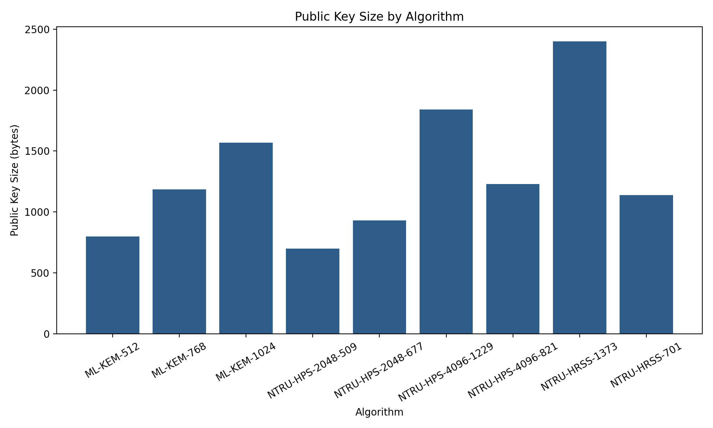
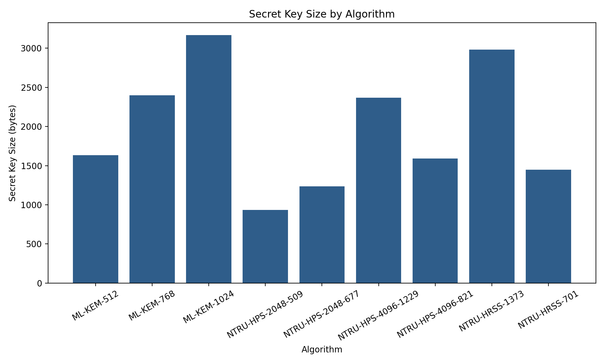
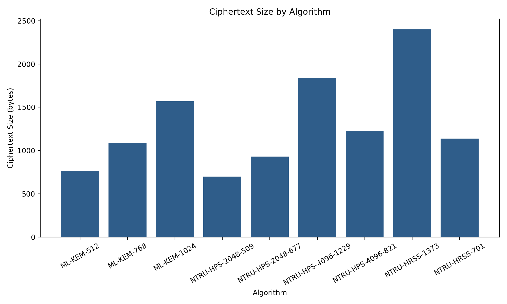
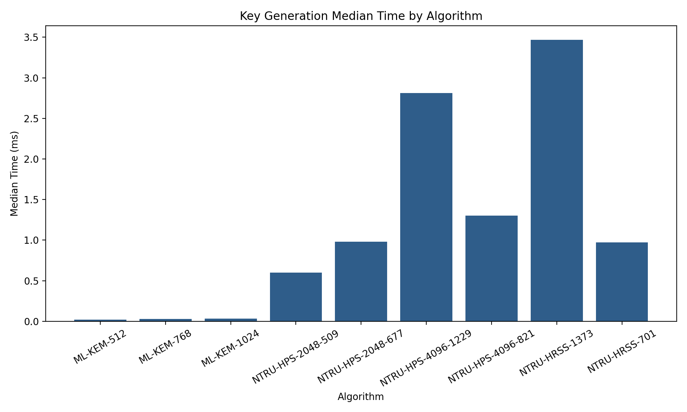
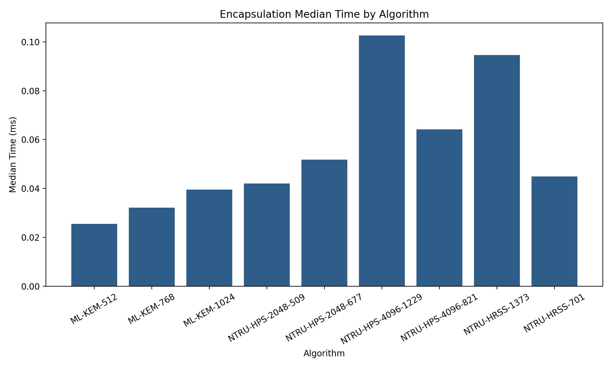
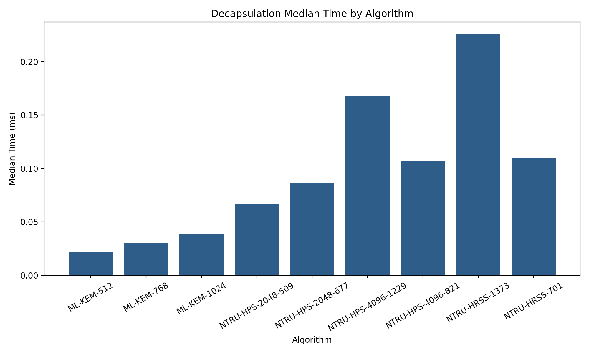

# pqc-kem-benchmark

`pqc-kem-benchmark` is a Docker-first Python project for benchmarking post-quantum key encapsulation mechanisms (KEMs) in a reproducible execution environment. The current benchmark pipeline focuses on `ML-KEM` and `NTRU` through the `oqs` Python bindings for `liboqs`, producing raw benchmark traces, processed comparison datasets, and plots from a single workflow.

The project is structured as a small benchmarking and analysis pipeline with clear separation between benchmark collection, result processing, and visualization. `SABER` support is included as an optional scaffold and can be extended when a dedicated backend is integrated.

## Why This Project Matters

Post-quantum cryptography addresses the long-term risk that large-scale quantum computers could break widely deployed public-key systems. KEMs are central to post-quantum key exchange, but practical adoption depends on more than security claims alone.

Benchmarking KEMs matters because real deployment tradeoffs include latency, key sizes, ciphertext sizes, and implementation overhead. A project like this helps compare candidate schemes in a way that is useful for engineering, experimentation, and applied cryptography research.

## Features

- Benchmarks key generation, encapsulation, and decapsulation for supported KEMs
- Collects public key, secret key, ciphertext, and shared secret size metadata
- Saves raw benchmark outputs to `results/raw/`
- Produces normalized JSON and CSV outputs in `results/processed/`
- Generates plots automatically from processed results
- Uses a Docker-first workflow for reproducible execution and dependency isolation

## Project Structure

```text
pqc-kem-benchmark/
├── main.py
├── benchmark_oqs.py
├── benchmark_saber.py
├── combine_results.py
├── plot_results.py
├── benchmark_schema.py
├── verify_oqs.py
├── Dockerfile
├── docker-compose.yml
├── run_in_docker.sh
├── requirements.txt
├── README.md
├── results/
│   ├── raw/
│   │   └── oqs_results.json
│   └── processed/
│       ├── all_results.json
│       └── all_results.csv
└── plots/
    ├── public_key_size.png
    ├── secret_key_size.png
    ├── ciphertext_size.png
    ├── keygen_median_ms.png
    ├── encaps_median_ms.png
    └── decaps_median_ms.png
```

## Quick Start

Docker is the recommended execution path. It avoids host-level `liboqs` installation issues and provides a clean, reproducible environment for benchmarking.

Build the Docker image:

```bash
docker compose build
```

Verify that `oqs` is available inside the container:

```bash
./run_in_docker.sh python verify_oqs.py
```

Run the OQS benchmark:

```bash
./run_in_docker.sh python main.py oqs
```

Combine raw results:

```bash
./run_in_docker.sh python main.py combine
```

Generate plots:

```bash
./run_in_docker.sh python main.py plot
```

Equivalent direct Docker Compose commands:

```bash
docker compose build
docker compose run --rm pqc-bench python verify_oqs.py
docker compose run --rm pqc-bench python main.py oqs
docker compose run --rm pqc-bench python main.py combine
docker compose run --rm pqc-bench python main.py plot
```

## Output

After a successful run, the project generates:

| Output Type | File |
| --- | --- |
| Raw benchmark results | `results/raw/oqs_results.json` |
| Processed JSON | `results/processed/all_results.json` |
| Processed CSV | `results/processed/all_results.csv` |
| Plot images | `plots/*.png` |

The Docker workflow bind-mounts the repository into the container, so all generated outputs remain visible in the local project directory on the host.

## Results

The generated plots provide a compact visual comparison of cost and size tradeoffs across the benchmarked KEMs. Together, they show how algorithm families differ not only in cryptographic object sizes but also in median runtime for core KEM operations. These figures make it easier to reason about practical deployment considerations than raw JSON alone.

### Public Key Size



### Secret Key Size



### Ciphertext Size



### Key Generation Median Time



### Encapsulation Median Time



### Decapsulation Median Time



In practice, these plots highlight the usual systems tradeoff surface: some schemes are more compact, some are faster, and some balance runtime against larger key or ciphertext sizes. The point of the project is to make those differences measurable and reproducible in a controlled environment.

## Benchmark Metrics

The benchmark pipeline measures:

- key generation time
- encapsulation time
- decapsulation time
- public key size
- secret key size
- ciphertext size
- shared secret size
- memory usage, when available from the Python-side instrumentation

## Methodology

- Benchmarks run in a Docker-based isolated environment
- `ML-KEM` and `NTRU` are benchmarked through the `oqs` Python bindings for `liboqs`
- Timing uses repeated benchmark iterations with warm-up runs before measured samples
- Raw results are written as JSON, normalized into CSV, and then converted into plots
- Final performance numbers depend on the underlying hardware, CPU behavior, and backend implementation details

## Limitations

- Only the algorithms currently integrated into the benchmark pipeline are measured
- `SABER` may still require a separate backend integration path for full benchmarking support
- Timing results depend on the host hardware even when the workflow is containerized
- Optimization levels and backend implementation details in `liboqs` can affect fairness across algorithms
- Memory measurements are approximate and may not reflect total native-library memory usage

## Future Work

- Full `SABER` backend integration
- Support for additional post-quantum KEMs
- Multi-platform comparison across different CPUs and environments
- Publication-quality statistical analysis and repeated-run summaries
- Benchmark dashboards or notebook-based analysis workflows

## Summary

This repository provides a focused framework for practical post-quantum KEM benchmarking with containerized execution, structured outputs, and reproducible analysis. It is intended for engineering evaluation, experimentation, and research-oriented comparison of post-quantum key encapsulation schemes.
